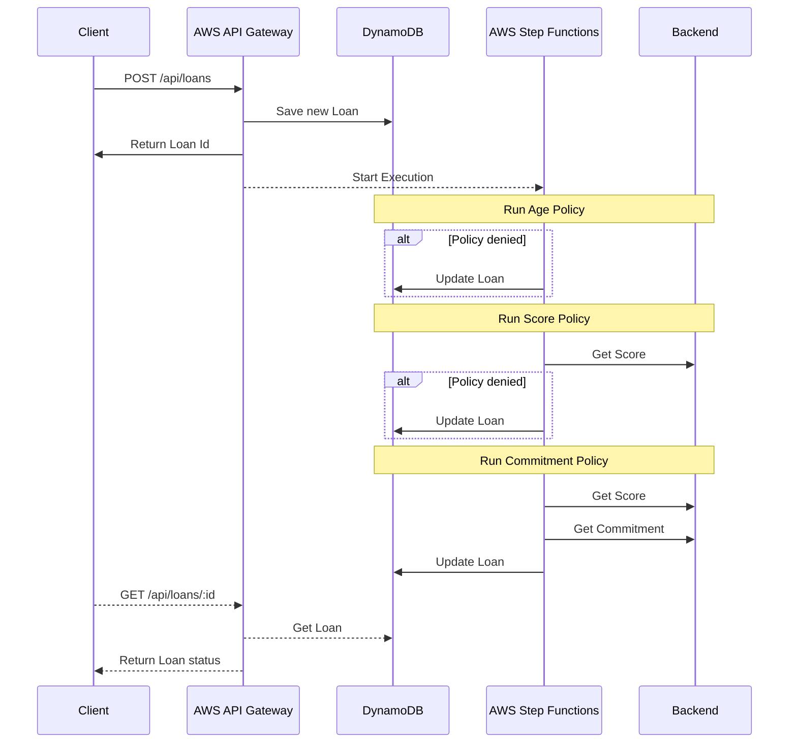

## Welcome to Noverde Challenge

[](http://www.serverless.com)

<a href="https://github.com/psf/black"></a>

> Challenge Link: https://github.com/noverde/challenge

#### Challenge Goals
* Runs a REST API for create Loans and retrieve his state
* Runs asynchronously Loan credit analysis
* Both State Machine flows and Policy rules must be easy customized
* (Bonus) Runs project in serverless environment

#### Stack
* Language: Python 3.7
* [Serverless Framework](https://serverless.com/)

##### AWS Resources configured
* AWS DynamoDB
* AWS API Gateway
* AWS Step Functions
* AWS X-Ray

#### Workflow

### Install
##### 1. Install Prerequisites
* Python 3.7: [https://www.python.org/downloads/](). We recommend using
  [pyenv](https://github.com/pyenv/pyenv-installer)
* Node 12+: [https://nodejs.org/en/download/]()
* Serverless Framework: [https://serverless.com/framework/docs/getting-started/]()
* Poetry: [https://python-poetry.org/docs/#installation]()
* AWS CLI command line: [https://docs.aws.amazon.com/pt_br/cli/latest/userguide/cli-chap-install.html]()

##### 2. Install Project
Clone project and type:
```bash
cd /path/to/noverde_challenge
make install
```

##### 3. Configure AWS
Make sure you have configured a AWS Administrator access in you machine
as per:
* https://docs.aws.amazon.com/pt_br/cli/latest/userguide/install-cliv2-linux-mac.html
* https://docs.aws.amazon.com/pt_br/cli/latest/userguide/cli-chap-configure.html

##### 4. Configure Serveless
1. On terminal type `sls login` to login or Signup to serveless
   account.
2. Type `sls dashboard` to open you dashboard. Go to ***Profiles*** ->
   *your profile* -> ***Parameters*** and add the following data:

| Field              | Value                     |
|:-------------------|:--------------------------|
| NOVERDE_API_TOKEN  | API token            |
| NOVERDE_SENTRY_DSN | (optional) You Sentry DSN |

### Running Application
**Local**: Use command `sls offline start`. It will:
* Start local DynamoDB (shell at [http://localhost:8000/shell]())
* Start local API Gateway at [http://localhost:/3000]()

Currently, `serverless-step-functions-offline-plugin` does not support Python.

**Remote**: Use command `sls deploy`. It will deploy the application using configured AWS Account:

### Working Link:
To test without install/config the project please use the following link:
* POST [https://e3sd2t641g.execute-api.us-east-1.amazonaws.com/dev/api/loans]()
* GET [https://e3sd2t641g.execute-api.us-east-1.amazonaws.com/dev/api/loans/{loan_id}]()

A postman collection can be found [here](https://www.getpostman.com/collections/48f4195a121fc89a11e2)